3.3 User interface
------------------

To understand how to work with the system, let's look at it using the user path. Fig. 3.3 shows what actions a local department administrator can perform and what path they need to go through to call them. For the manager of the local department, the path will be much shorter, because most of the functions performed by the administrator are not available to him, so after logging in, he will be immediately directed to the management center and can only perform actions in this branch of the user flow.

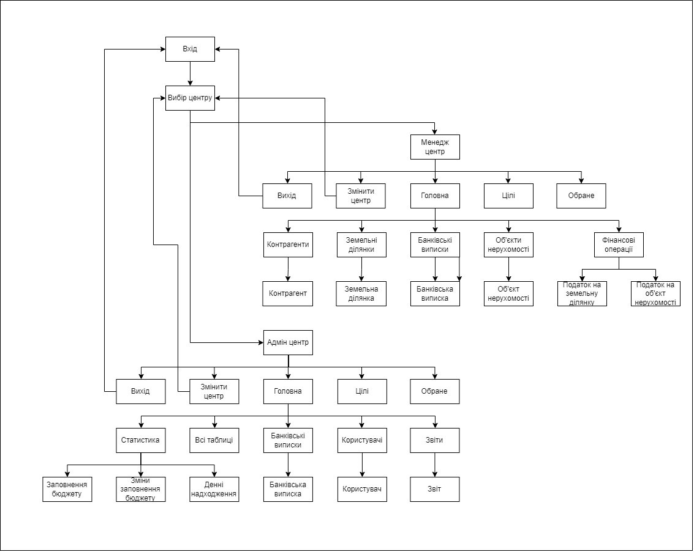

Figure 3.3 - User flow for the local department administrator

The administrator of the main department does not need so much functionality. Therefore, to solve his tasks, another user path is built as shown in Fig. 3.4 Since the main task for this type is analytics, the main directions of the path end with obtaining analytical data, such as graphs or reports.

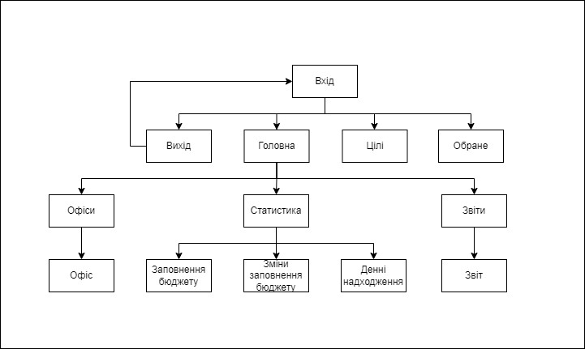

Figure 3.4 - User flow of the main department administrator

When you start the program, the authorization window opens (Fig. 3.5, a).

The authorization form contains 2 input fields: "Login" and "Password", and 2 buttons: "Login" and "Forgot password". When you click on the "Login" button, the client connects to the server and tries to receive data from it. If the connection to the server fails, the form displays the error shown in Fig. 3.5,в. If the connection is set up, but there is no such user in the system or the password is incorrect, the error shown in Fig. 3.5,б. The user will not get access to the following windows until he/she is authenticated. Further, depending on the level of the department and the user group, the following forms will be offered to the user.

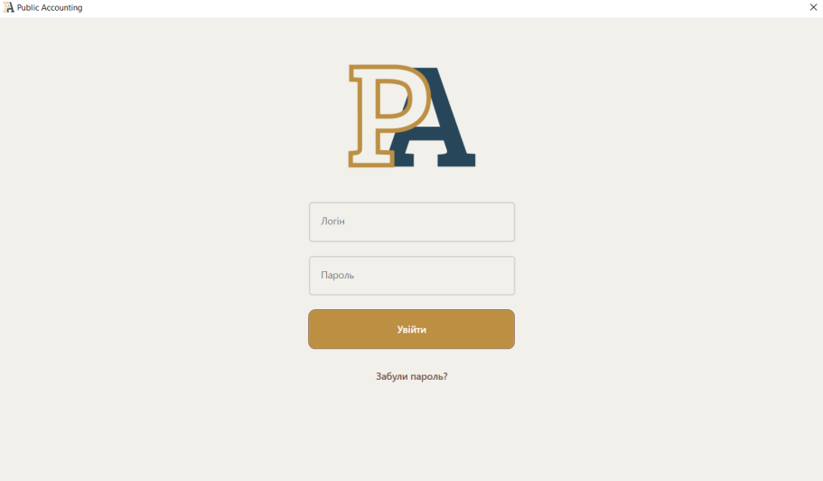

а)

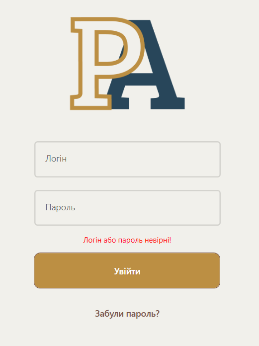                        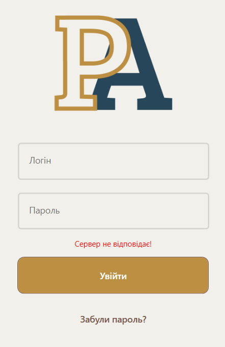

     б)                                                                   в)

Figure 3.5, initial view of the authorization window (a), data entry error (b), connection error (c)

If this is a local department and the user is an administrator, he or she will be offered a selection window (Figure 3.6). At this stage, the administrator chooses whether he or she will do managerial or personal work.

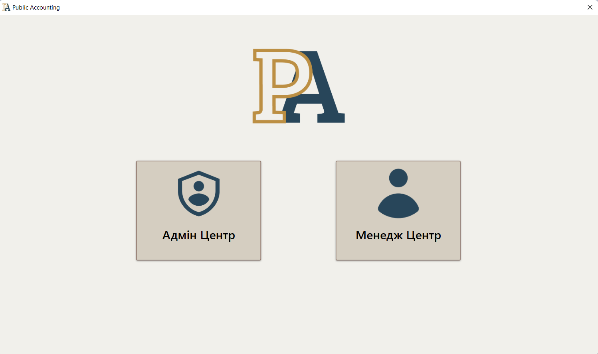

Figure 3.6 - Administrator selection window

If it is a local department and the user group is a manager, or if the administrator has decided to perform the work of a manager, the main page of the manager will be opened (Fig. 3.7). This page contains the navigation bar, buttons for switching to the main tables ("Counterparties", "Land plots", "Real estate objects"), the "Financial transactions" button, and a panel with bank statements.

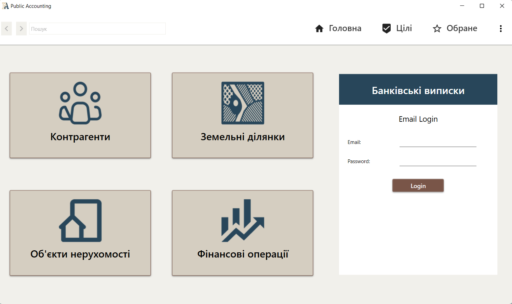

Figure 3.7 - Main form of the local department manager

If the user group in the local department is administrator, then he has access to functions that are not available to the manager, these functions are located on the administrator's main page. It looks the same as the manager's main page, but the buttons are completely different (Figure 3.8). The "Users" button directs you to view all users that exist in the system. The "All tables" button takes you to the list of all tables in the system, where the administrator can edit the data. By clicking on the "Reports" button, you can print the necessary reports. And by clicking on the "Statistics" button, you can view the system statistics.

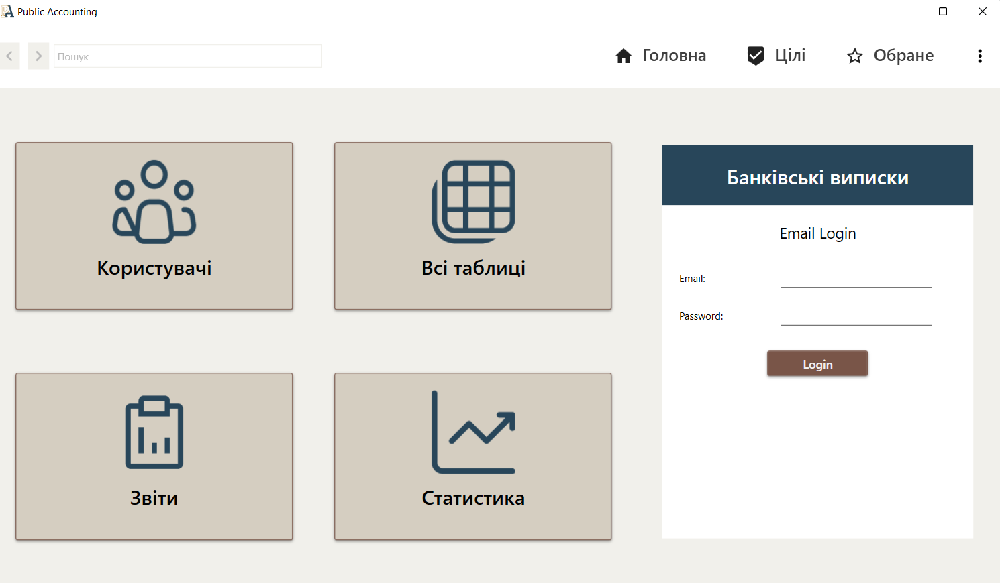

Figure 3.8 - Main form of the local department administrator

If it is a head office, the head office administrator page will be opened (Figure 3.9). This page contains: the "Offices" panel for viewing offices in the system and editing them, and two other panels that are identical to the functionality of the local department administrator.

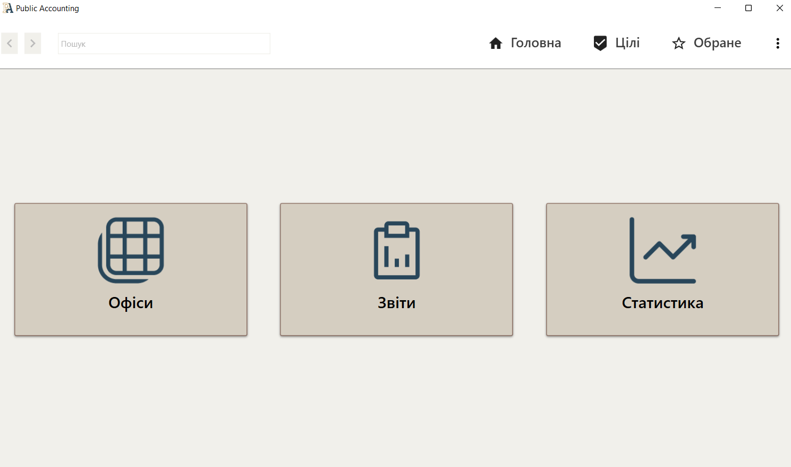

Figure 3.9- Main form of the main department administrator

The navigation bar is displayed throughout the work on all the following forms. It contains the "Back" button - return to the previous form, "Search" - search for the required window, "Home" - returns to the main screen of the manager, "Goals" - the tasks set by the manager, "Favorites" - selected items and the "More" element, which contains "Change center" and "Exit".

Clicking on one of these buttons to go to the main tables opens a window for viewing the table data in the form of a detailed list of all records (Figure 3.10). Depending on the user's needs, they can be sorted by any criteria.

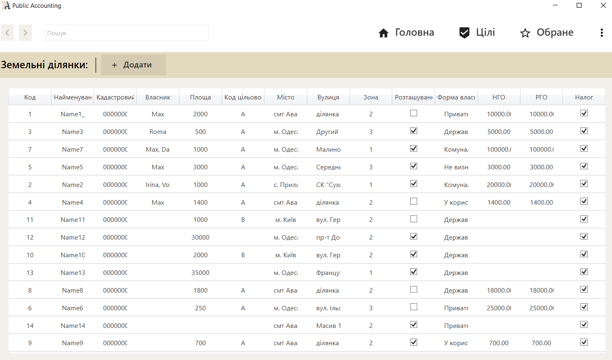

Figure 3.10 - Displaying the list of "Land plots" records

Double-clicking on the desired field opens detailed information about this record (Figure 3.11). Initially, all fields are read-only. If you click the "Edit" button, all the data will be available for editing at once, except for the "Code" field and existing historical tables, and the button itself will change its name to "Save", which you must click to save the data. The "Delete" button deletes the record from the database.

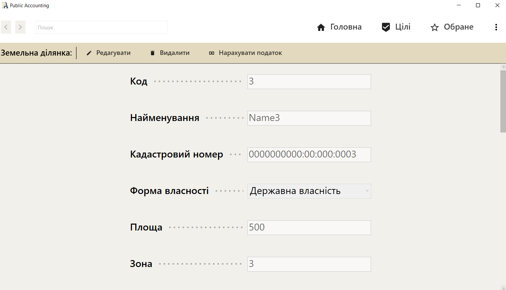

Figure 3.11 - Displaying the "Land plot" object card

The "Financial transactions" button opens a window with a list of transactions for calculating tax (Figure 3.12). When you click on one of them, a notification is displayed that checks whether you really need to run the operation. After confirmation, the required operation is performed.

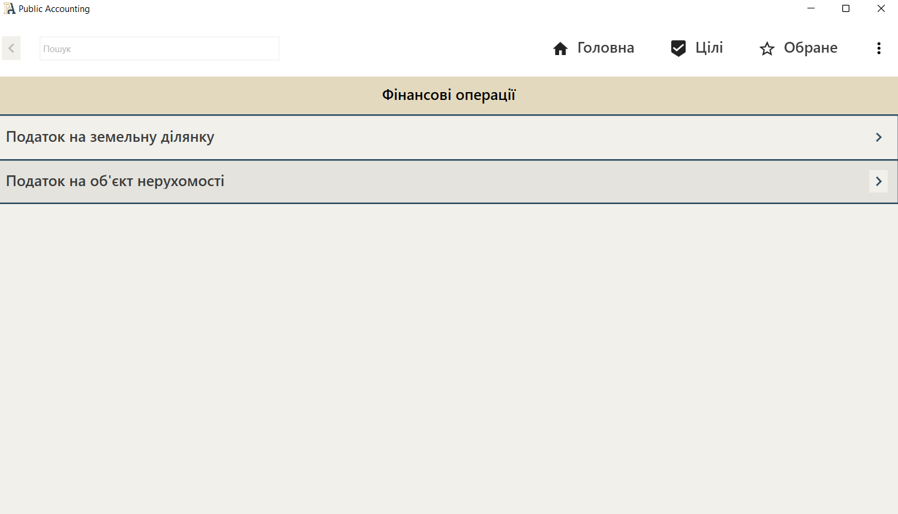

Figure 3.12 - Financial transactions form

The "Bank statements" panel allows you to process documents received from the bank in a .dbf file and add changes to the database. After entering the mail account data, this panel displays a list of all the files that have not been added to the system (Fig. 3.13). After selecting one of the files, a window similar to Fig. 3.10 in which it is possible to check all payments and, if necessary, edit erroneous data similarly to Fig. 3.11. After checking, the "Confirm" button is pressed and all statements are sent to the server. If a counterparty is found that is not in the system, the user will be returned invalid statements for further editing.

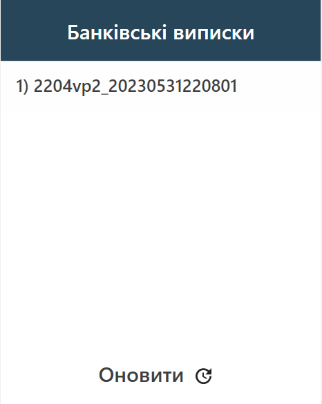

Figure 3.13 - Displaying statements not entered into the system

The "Statistics" panel contains various types of analytical data necessary for analyzing tax payments (see Figure 3.14). For this purpose, tabs have been created that display data on budget completion, daily receipts, and total receipts. All this can be viewed quarterly for each year, or in general. If this tab is opened by the administrator of the main department, he or she has the opportunity to view such data for each active department in the system.

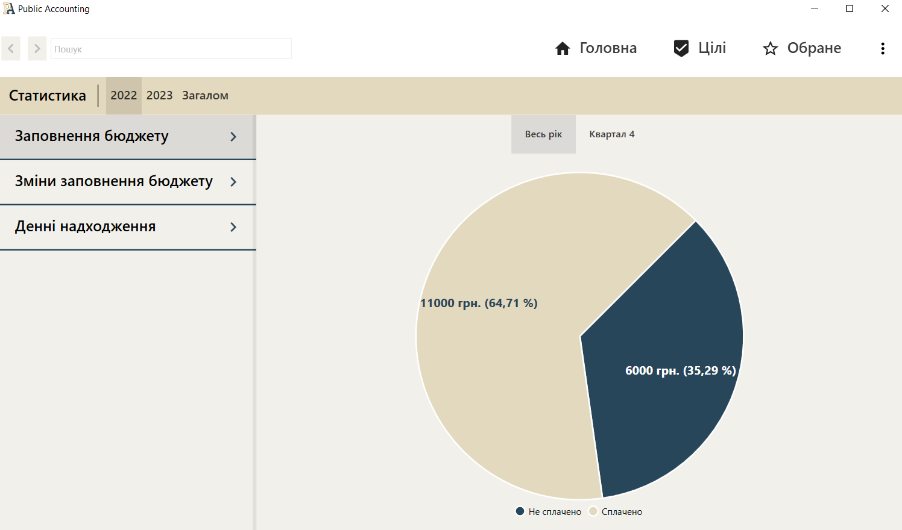

Figure 3.14 - Displaying analytical data